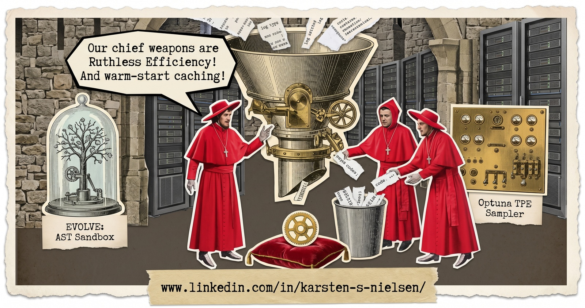

# Ruthless Efficiency

[](https://github.com/karsten-s-nielsen/ruthless-efficiency/actions/workflows/ci.yml)
[](https://pypi.org/project/ruthless-efficiency/)
[](https://www.python.org/downloads/)
[](LICENSE)

> "Our chief weapons are Ruthless Efficiency! …and warm-start caching."

A general optimisation/search substrate: a pure hexagonal core + pluggable search strategies
(`random` built-in; `evolve`, `optuna` via extras) + pluggable compute backends.



## Status

`0.x` — ports are still being validated against real consumers; the API may change until `1.0`.

## Prerequisites

- **Python ≥ 3.10**
- `pip` (or [`uv`](https://docs.astral.sh/uv/) for development — see [CONTRIBUTING.md](CONTRIBUTING.md))

## Install

- `pip install ruthless-efficiency` — core + random strategy
- `pip install "ruthless-efficiency[optuna]"` — + Optuna strategy (resumable Bayesian/sampler calibration)
- `pip install "ruthless-efficiency[evolve]"` — + evolve strategy (our orchestration over OpenEvolve)
- `pip install "ruthless-efficiency[backends]"` — + SSH / HF-Jobs / Docker compute backends

## Quick start

An `Objective` is the only thing you must implement: any class with an `evaluate(candidate)` method
that returns a `dict[str, float]` of metrics satisfies the `Objective` protocol (duck-typed — no base
class to inherit). Hand it to a strategy with a backend:

```python
from ruthless import Candidate, InProcessBackend, RandomConfig, RandomSearchStrategy


class Quadratic:
    def evaluate(self, candidate: Candidate) -> dict[str, float]:
        return {"loss": (candidate.params["x"] - 3.0) ** 2}


cfg = RandomConfig.model_validate(
    {
        "kind": "random",
        "metric": "loss",
        "direction": "minimize",
        "n_trials": 200,
        "param_space": {"x": {"kind": "float", "lo": -10.0, "hi": 10.0}},
    }
)
result = RandomSearchStrategy(cfg, seed=42).run(Quadratic(), backend=InProcessBackend())
print(result.best.candidate.params, result.best.metrics)
```

Expected output (search converges on `x = 3`, where `loss` is minimised; exact for seed `42`):

```text
{'x': 2.9969320310963994} {'loss': 9.412433193460362e-06}
```

Or drive it from a YAML config via the CLI:

```bash
ruthless --config search.yaml --objective my_package.objectives:my_objective
```

## Architecture

A pure hexagonal core (`ruthless/`) defines the ports (`Objective`, `SearchStrategy`,
`ComputeBackend`) and value types; strategies and backends depend on the core, never the reverse
(enforced by import-linter). For contributor-level detail see [CONTRIBUTING.md](CONTRIBUTING.md).

To explore the C4 diagrams (System Context, Containers, and Core Components), download
[`docs/c4/architecture.html`](docs/c4/architecture.html) and open it in a browser — GitHub does not
render HTML files inline.

## Learn more

- [CHANGELOG.md](CHANGELOG.md) — versioned history of what changed
- Strategies: `RandomSearchStrategy` (core), `OptunaStrategy` (`[optuna]`), `EvolveStrategy` (`[evolve]`)
- Compute backends (`[backends]`): build one with `ruthless.backends.create_backend(...)`

## Contributing & community

- [CONTRIBUTING.md](CONTRIBUTING.md) — dev setup and the local quality gate (mirrors CI).
- [CODE_OF_CONDUCT.md](CODE_OF_CONDUCT.md) — Contributor Covenant.
- [SECURITY.md](SECURITY.md) — how to report a vulnerability and the security surface.
- [NOTICE](NOTICE) — third-party licenses and methodological references.

## License

[MIT](LICENSE) © 2026 Karsten S. Nielsen
